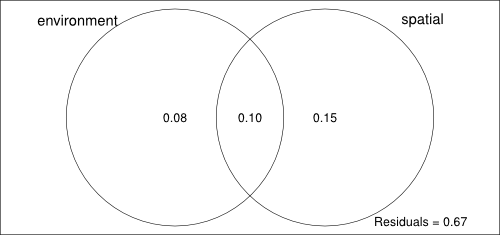

# Variation partitioning and checking for missing environmental factor in spatial component

#### Mario Jose Marques-Azevedo

This text show how to run partition variance and check if spatial component cam be attributed to neutral process, rather than environmental factors that are missing from the analysis. The partition variance was implemented by [Danilo Rafael Mesquita Neves](http://lattes.cnpq.br/7825577355355814) and [Pedro V. Eisenlohr](http://pedroeisenlohr.webnode.com.br/) and following Anderson and Legendre (1999), Blanchet et al. (2008), Bocard and Legendre (2011), Dray et al. (2006), Legendre et al. (2012), Legendre and Gallagher (2001) and Peres-Neto and Legendre (2010). The protocol to check spatial component was implemented by [Mario Jose Marques-Azevedo](https://github.com/mariojose) and following Diniz-Filho et al. (2012).

## Installing packages

Before start with analysis, we need install some packages:

- vegan;
- spdep (spacemakeR dependence);
- ade4 (spacemakeR dependence);
- tripack (spacemakeR dependence);
- packfor;
- spacemakeR.

If packages are not installed, run the following commands:

```r
install.packages("vegan") 
install.packages("spdep") # spacemakeR dependence
install.packages("ade4") # spacemakeR dependence
install.packages("tripack") # spacemakeR dependence

install.packages("packfor", repos = "http://R-Forge.R-project.org")
install.packages("spacemakeR", repos = "http://R-Forge.R-project.org")
```

After installing the packages we need load them.

```r
library(vegan)
library(packfor)
library(spacemakeR)
library(spdep)
```

Do not forget to set your working directory with `setwd` command.

## Variation partitioning

Before starting the analysis, we need load and check structure of database. We will use three variables names to data:

- `ll`: coordinate data with sites in rows and longitude and latitude in columns;
- `spp`: community data with sites in rows and species in columns;
- `env`: environmental data with sites in rows and variables in columns.

Despite it is not necessary to remove collinear variables prior to variation partitioning, you can eliminate collinear or otherwise superfluous variables if you are interested to obtain a parsimonious model.

We will use Barro Colorado Island (`BCI`) database from Condit et al. (2002) and Zanne et al. (2014) available in `vegan` package as example.

```r
# Load data from vegan package
data(BCI)
BCI.env <- read.delim ('http://www.davidzeleny.net/anadat-r/lib/exe/fetch.php?media=data:bci.env.txt')

# Using our variable names to data
ll <- BCI.env[ ,2:3]
spp <- BCI
env <- BCI.env[ ,-(1:3)]

# Naming rows with sites names
rownames(ll) <- rownames(spp) <- rownames(env) <- paste("site", 1:dim(ll)[1], sep="_")

# Removing original data from dashboard
rm(BCI, BCI.env)
```

To load your data, you can use `read.table` command like that:

```r
# Coordinate data (rows = sites; columns = long, lat)
ll <- read.table(file.choose(), row.names = 1, header = T, sep = ",")

# Community data (rows = sites; columns = species)
spp <- read.table(file.choose(), row.names =  1, header = T, sep = ",")

# Environmental data (rows = sites; columns = variables)
env <- read.table(file.choose(), row.names = 1, header = T, sep = ",")
```

Check if your database file is using comma (",") as data separator character. If you is using other, like semicolon (";") or tabulation (" "), change "sep" parameter of `read.table` command for your case.

Database files (for species abundance, environmental variables and coordinates data) must have the same rows names. For the three files, rows names are sites names of samples. Check your data using:

```r
View(ll)
View(spp)
View(env)
```

We need to prepare the data to analysis. For that, we need remove unicates (species that occur in one site) and standardize species and environmental data.

```r
# Removing unicates and Hellinger transformation
spp.std <- decostand(spp[ ,apply(spp > 0, 2, sum) > 1], "hellinger")

# Standardization of environmental data
env.std <- decostand(env, "standardize")
```

We will generate and test the significance of spatial variables (Moran's Eigenvector Maps - MEMs) to use them in our analysis.

```r
# Convert coordinates to neighbours list. See Borcard et al. (2011) for details.
ll.nb <- tri2nb(ll)

# Spatial weights to neighbour list. See Borcard et al. (2011) for details.
ll.wgh <- nb2listw(ll.nb, style = "B")

# Compute Moran's eigenvectors
mem <- scores.listw(ll.wgh)
```

To make data visualization easier, we will naming columns and rows of generated MEMs vectors. 

```r
# Name columns
colnames(mem$vectors) <- paste("MEM_", 1:ncol(mem$vectors), sep = "")

# Name rows
rownames(mem$vectors) <- rownames(ll)
```

Now, we can compute and test Moran's I for MEMs and select only MEMs that are significant at 0.05 confidence level.

```r
# Compute and test Moran's I for eigenvectors of spatial weighting matrices
mem.test <- test.scores(mem, ll.wgh, 999)

# Select significant MEMs at 0.05 confidence level
mem.sel <- list(values = mem$values[mem.test[ ,"pval"] < 0.05], 
                vectors = mem$vectors[ ,mem.test[ ,"pval"] < 0.05])

# Checking how many MEMs was selected (rows, columns)
dim(mem.sel$vectors)
```

Finishing data to variation partitioning, we will select significant MEMs for our species data using forward selection.

```r
# Selecting MEMs via forward selection
rda.spa <- rda(spp.std, mem.sel$vectors)
rda.spa.sel <- forward.sel(spp.std, mem.sel$vectors, adjR2thresh = RsquareAdj(rda.spa)$adj.r.squared)

#Checking selected MEMs for species data
rda.spa.sel
```

The same procedure for environmental data.

```r
# Selecting environmental variables via forward selection
rda.env <- rda(spp.std, env.std)
rda.env.sel <- forward.sel(spp.std, env.std, adjR2thresh = RsquareAdj(rda.env)$adj.r.squared)

#Checking selected MEMs for environmental data
rda.env.sel
```

We will create a `spatial` variable with only MEMs selected by forwarding select procedure. The same will be done to environmental variables selected, `environment` variable. This variables will be used in variation partitioning.

```r
# Preparing selected variables for variance partitioning

# Filter MEMs from significant selected MEMs to MEMs selected in RDA
spatial <- list(values = mem.sel$values[colnames(mem.sel$vectors) %in% rda.spa.sel$variables],
                vectors = mem.sel$vectors[ ,colnames(mem.sel$vectors) %in% rda.spa.sel$variables])

# Checking selected MEMs
dim(spatial$vectors)

# Filter environment data to selected environmental variables in RDA
environment <- env.std[ ,rda.env.sel$variables]

# Checking selected environmental variables
dim(environment)
```

Finally we will run variation partitioning.

```r
# Variance partitioning
all.varpart <- varpart(spp.std, environment, spatial$vectors)
all.varpart

plot(all.varpart, Xnames = c("environment", "spatial"))
```

<div style="text-align: center">
  
</div>
<br />

Now we can testing environmental and spatial components significance.

```r
# Testing the environmental significance, after considering the effect of selected MEMs
rda.env.spa <- rda(spp.std, environment, spatial$vectors)
env.aov <- anova(rda.env.spa)
env.aov

# Testing the spatial significance, after considering the effect of selected 
#  environmental variables
rda.spa.env <- rda(spp.std, spatial$vectors, environment) 
spa.aov <- anova(rda.spa.env)
spa.aov
```

## Checking for missing environmental factor in spatial component

Diniz et al. (2012) proposed a protocol to test if amount of variation predicted by pure spatial component [c] can be safely attributed to neutral process, rather than lack of spatially structured environmental predictor. If matrix correlation of species abundance (R) hasn't correlation with matrix of species spatial maps (M), then spatial component [c] can safely attributed do neutral process.

This protocol is valid only if you species data contain species abundance. For occurrence data this protocol do not work. 

Before start the analysis we need the download function `correlogI`. You can download the [`correlogI`](https://github.com/MarioJose/r-functions/tree/master/correlogI) function at [this link](https://raw.githubusercontent.com/MarioJose/r-functions/master/correlogI/correlogI.r). Save the function script at your work directory. Read [`correlogI`](https://github.com/MarioJose/r-functions/tree/master/correlogI) function page for more information.

```r
# Load correlogram function.
source("correlogI.r")
```

We will define the number of class for our correlogram using Sturges's rule

```r
# Number of classes: Sturges' rule
nc <- round(1 + (1/log10(2)) * log10(length(dist(ll)[upper.tri(dist(ll), diag = FALSE)])), 0)
```

We will predict species abundance from pure spatial variation [c]. For this we predict abundance from a full model [a + b + c] and subtract from abundance predicted from environmental model [a + b]. After that, we will create a correlation matrix (R) of abundance predicted by pure spatial component.

```r
# Predicting species abundance from pure spatial variation [c]
pred.spa <- predict(rda(spp.std, cbind(environment, spatial$vectors))) - predict(rda(spp.std, environment))

# Matrix with species correlation
R <- cor(pred.spa)
```

Now, we will calculate correlogram for each species.

```r
# Matrix with species correlogram
corr <- matrix(NA, nrow = nc, ncol = dim(pred.spa)[2], dimnames = list(1:nc, colnames(pred.spa)))

for(i in 1:dim(corr)[2]){
  corr[ ,i] <- correlogI(pred.spa[ ,i], ll)$result$I
} 
rm(i)
```

Then, we can create a matrix of pairwise Manhattan similarity (M) among species correlogram.

```r
# Matrix of pairwise similarity among correlogram (Manhattan distance)
M <- matrix(NA, nrow = dim(pred.spa)[2], dim(pred.spa)[2], dimnames = list(names(pred.spa), names(pred.spa)))

# 3D array with x and y to species and z to distance classes
tmp <- array(NA, c(dim(pred.spa)[2],dim(pred.spa)[2],nc))

for(k in 1:nc){
  tmat <- matrix(rep(corr[k, ], times = dim(pred.spa)[2]), nrow = dim(pred.spa)[2], ncol = dim(pred.spa)[2])
  tmp[, , k] <- abs(tmat - t(tmat)) / nc
}

# Sum distance classes difference (z axis)
M[] <- apply(tmp, c(1,2), sum, na.rm = TRUE)

rm(k, tmp)
```

Finally, we can check if neutral process can be safely attributed to spatial component.

```r
# Checking with R and M are correlated
mantel(M, R)
```

If we have no correlation (Matel correlation) among M and R matrix, we can safely attribute neutral process to spatial component.

# Bibliography

Anderson, M. J. & P. Legendre. 1999. An empirical comparison of permutation methods for tests of partial regression coefficients in a linear model. Journal of Statistical Computation and Simulation 62: 271-303.

Blanchet F. G., P. Legendre, and D. Borcard. 2008. Forward selection of explanatory variables. Ecology 89: 2623-2632.

Borcard, D., F. Gillet & P. Legendre. 2011. Numerical Ecology with R. Springer, New York, 302p.

Diniz-Filho, J. A. F. et al. 2012. Spatial autocorrelation analysis allows disentangling the balance between neutral and niche processes in metacommunities. Oikos 121: 201–210.

Dray, S., P. Legendre and P. Peres-Neto. 2006. Spatial modelling: a comprehensive framework for principal coordinate analysis of neighbor matrices (PCNM). Ecological Modelling 196: 483-493.

Legendre, P., D. Borcard and D. W. Roberts. 2012. Variation partitioning involving orthogonal spatial eigenfunction submodels. Ecology 93: 1234-1240.

Legendre, P. and E. Gallagher. 2001. Ecologically meaningful transformations for ordination of species data. Oecologia 129: 271-280.

Peres-Neto, P. R. and P. Legendre. 2010. Estimating and controlling for spatial structure in the study of ecological communities. Global Ecology and Biogeography 19: 174-184.

# Data bibliography

Condit, R, Pitman, N, Leigh, E.G., Chave, J., Terborgh, J., Foster, R.B., Nuñez, P., Aguilar, S., Valencia, R., Villa, G., Muller-Landau, H.C., Losos, E. & Hubbell, S.P. (2002). Beta-diversity in tropical forest trees. Science 295, 666–669.

Zanne A.E., Tank D.C., Cornwell, W.K., Eastman J.M., Smith, S.A., FitzJohn, R.G., McGlinn, D.J., O’Meara, B.C., Moles, A.T., Reich, P.B., Royer, D.L., Soltis, D.E., Stevens, P.F., Westoby, M., Wright, I.J., Aarssen, L., Bertin, R.I., Calaminus, A., Govaerts, R., Hemmings, F., Leishman, M.R., Oleksyn, J., Soltis, P.S., Swenson, N.G., Warman, L. & Beaulieu, J.M. (2014) Three keys to the radiation of angiosperms into freezing environments. Nature 506, 89–92, doi:10.1038/nature12872.
